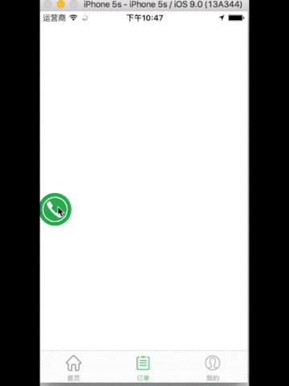

### 悬浮日志面板 **Pig**
> 实现一个`APP`内悬浮窗口可实时打印日志,项目名称：**Pig**

#### 开发要点
1. 悬浮窗口在`APP`内任意页面切换都存在
2. 退出APP或者`Home`、`Power`键出去悬浮窗消失
3. 可便捷打印日志，如 `Pig.D(TAG,"Here is a Message.");`
4. 要求可在`APP`中配置开启与关闭
5. 点击面板支持收缩与展开，默认状态下处于收缩状态
6. 要求可任意拖动
7. 要求支持的系统版本是 `Android4.4+`,最好能做到无权限提示,无系统兼容性问题(如 **小米系列** 、**部分Android8.0** )
8. 要求无闪退、无掉帧、无内存泄漏
9. 代码需提交至`Gitlab`,每完成一个功能点，并填写`Commit`
10. 要求按照项目开发规范书写代码、按照 **Git提交规范** 提交代码

#### 参考图片


### 1 简介
**Pig是一个log打印工具，提供一个悬浮窗来展示打印的log，悬浮窗可在屏幕内自由拖动，在项目测试时方便查看关键的log信息。**
### 2 快速集成
* **Gradle依赖**

Pig组件库通过aar形式存在美图maven仓库，关于如何配置美图私有maven仓库，请[直戳](http://techgit.meitu.com/android/MavenWiki/wikis/maven_config)。
对应在主工程下的build.gradle引入pig的库：

```groovy
dependencies {
    ...
    compile "com.meitu.library:pig:1.0.0-SNAPSHOT"
    ...
}
```
* **调用示例**
    * 在应用初始化的时候调用Pig组件的初始化接口Pig.init()，如
    ```java
        @Override
        protected void onCreate(Bundle savedInstanceState) {
            super.onCreate(savedInstanceState);
            Pig.init(this);
        }
    ```
    * 在应用退出时调用Pig组件的反初始化接口Pig.unInit(),如
    ```java
        @Override
        protected void onDestroy() {
            super.onDestroy();
            Pig.unInit();
        }
    ```
    * 在应用需要打印log的时候调用打印log接口Pig.D(), 如
    ```java
     Button mShowBtn = (Button) findViewById(R.id.btn_pig_show);
     mShowBtn.setOnClickListener(new View.OnClickListener() {
            @Override
            public void onClick(View v) {
                Pig.D("Pig", "分辨率：1280*720");
            }
        });
    ```
    * 设置Pig组件log最多可打印的行数可调用Pig.setLineNum()，如
    ```java
    @Override
    protected void onCreate(Bundle savedInstanceState) {
        super.onCreate(savedInstanceState);
        PLog.i("zhoufucai", "MainActivity onCreate. ");
        Pig.init(this);
        Pig.setLineNum(10); //设置打印行数
    }
    ```
# 1.0.1 更新说明
* [优化]悬浮窗贴边逻辑以悬浮窗宽度的中心点作为边界，拖动到屏幕宽度中心点左边就贴在左边，否则右边；
* [优化]清除组件库中无用的资源文件；


